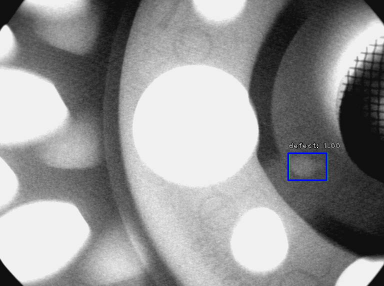
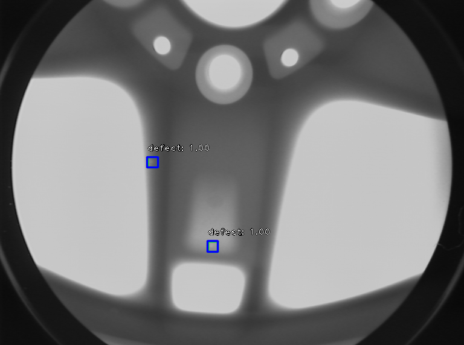
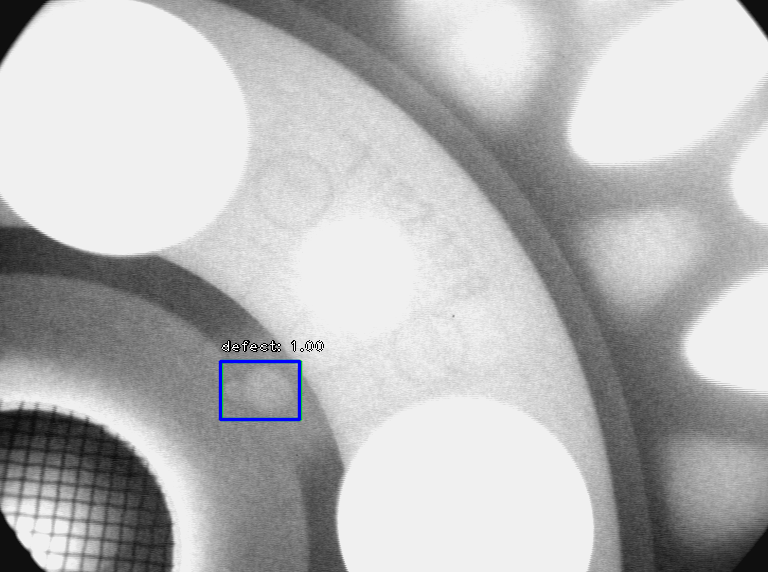

# GDXray-retinanet

This project applies the [RetinaNet](https://arxiv.org/abs/1708.02002) object detector to the [GDXray](http://dmery.ing.puc.cl/index.php/material/gdxray/) dataset, Castings group.

A sampling of inital results show below. 
Annotations bounding-boxes are *green*, detections in *blue*.

 

